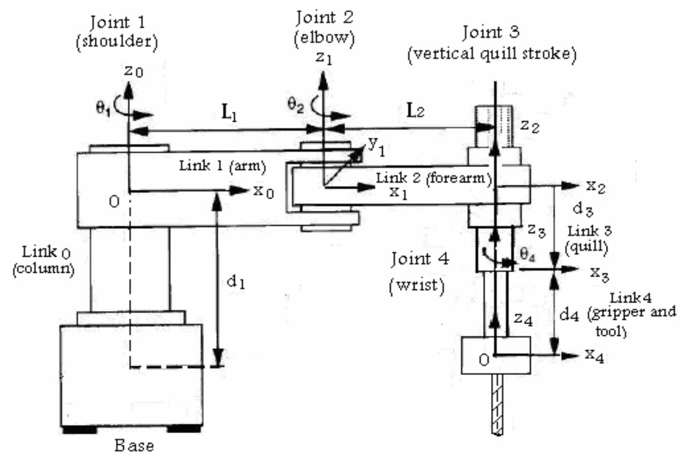

# 기구 체인 (Kinematic Chain)

조립체·부품 명명은 아래 운동 체인을 기준으로 맞춘다.




```text
BASE_MOUNTING_PLATE      베이스 고정판(base mounting plate)   (고정)
-> BASE_COLUMN           베이스 기둥(base column)            (고정)
-> COLUMN_Z_SLIDE (J1)   Z 레일(Z rail)                     — Z축 병진(수직 이동)
-> ARM_CARRIAGE          암 캐리지(arm carriage)             — Z 레일 이동체, 어깨 관절 마운트
-> SHOULDER_JOINT (J2)   어깨 관절(shoulder joint)           — 수평 회전, 상완 선회
-> UPPER_ARM             상완 링크(upper arm)
-> ELBOW_JOINT (J3)      팔꿈치 관절(elbow joint)            — 수평 회전, 전완 선회
-> FOREARM               전완 링크(forearm)
-> TOOL_ROLL (J4)        툴 롤(tool roll)                   — Z축 회전, 공구 방향
-> TOOL_FLANGE           툴 플랜지(tool flange)
```

링크의 양끝은 기준부에 가까운 쪽을 `proximal pivot`(근위 피벗), 말단부에 가까운 쪽을 `distal pivot`(원위 피벗)으로 부른다.

```text
[proximal pivot] ── link body ── [distal pivot]
[근위 피벗]        ── 링크 몸체 ──  [원위 피벗]
```
